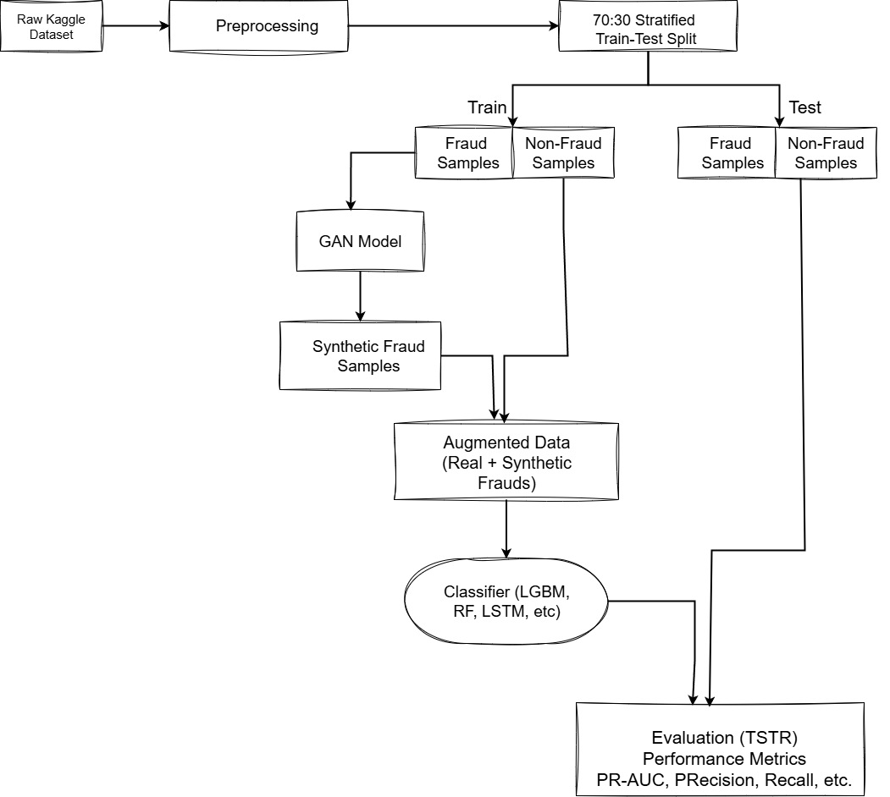

# Fraud Detection with GAN-Augmented Data

This repository contains experiments on fraud detection using various **Generative Adversarial Networks (GANs)** and classical as well as deep learning models.  
The goal is to handle the **class imbalance problem** in fraud datasets by generating synthetic fraud samples.

---

## 📌 Methodology

The methodology used for this work is shown below:



1. Preprocess the dataset (real credit card fraud data).  
2. Train different GAN variants (GAN, WGAN, CGAN, CTGAN, VAE-GAN) on minority fraud data.  
3. Generate synthetic fraud samples.  
4. Train classification models (Random Forest, LightGBM, LSTM, RNN, Transformer) on real + synthetic data.  
5. Evaluate using ROC-AUC, PR-AUC, F1-score, Precision, and Recall.

---

## ⚙️ Installation

Clone the repository:

```bash
git clone https://github.com/aditi2306/2425-CT5129-fraud-detection-code.git
cd 2425-CT5129-fraud-detection-code
```

It is recommended to use a Python virtual environment:
```
python -m venv venv
source venv/bin/activate   # On Linux/Mac
venv\Scripts\activate      # On Windows
```
Install the dependencies:
```
pip install -r requirements.txt
```
Note: Large dataset files are tracked with Git LFS.
